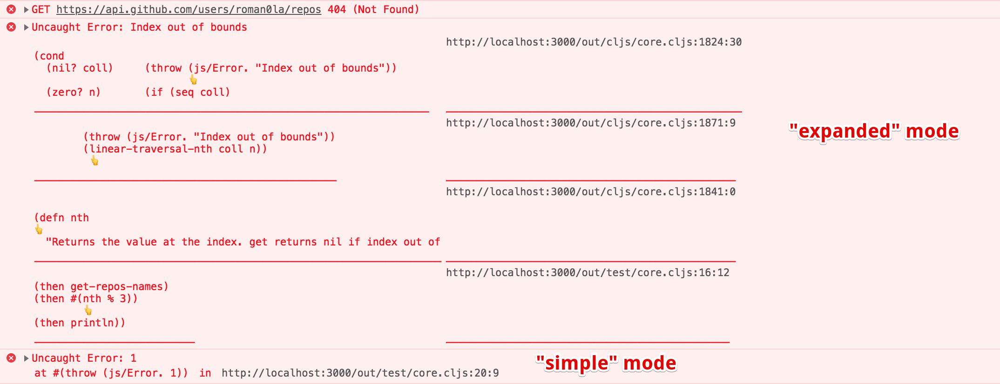

**Works only in Chrome**

## Limitations

- Not guaranteed to work 😜
- Links to source code in browser's console are not interactive
- No async stack traces

## Try

Enable Custom Formatters in Chrome ([see how](http://www.mattzeunert.com/2016/02/19/custom-chrome-devtools-object-formatters.html))

Serve from `public` dir and open browser console

## Build

```
clj -m cljs.main -co prod.cljs.edn -c test.core
```

or

```
clj -m cljs.main -co dev.cljs.edn -c test.core
```

or

```
clj -m figwheel.main -b dev -r
```

## How to use

- See bootstrapping code in [src/test/preload.cljs](src/test/preload.cljs) after line 46
- Or add `:preloads [test.preload]` to compiler options

## Options

```js
{
    message: "{error.message}",
    stack: "{error.stack}",
    linesInFrame: 3, // (target line + 2 sinbling lines)
    maxLines: 10, // max number of lines to print
    excludes: [], // filters out stack frames based on file path regex [".*\/cljs\/core.cljs$"]
    mode: "expanded" // "simple" | "expanded" (see screenshot in the beginning of the document)
}
```

## Using dev server to offload browser process

1. Install NPM deps
2. Run `node server/index.js --port {PORT}`
3. Add this script to your HTML `<script src="http://localhost:{PORT}/runtime"></script>` to connect to server
